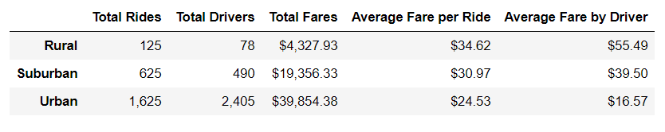
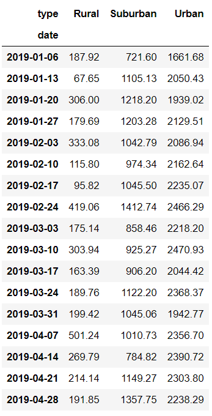
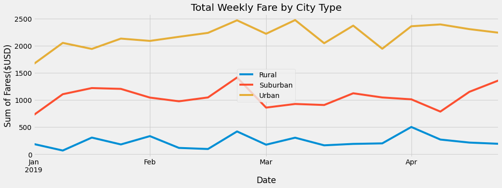

# PyBer

## Overview

The purpose of this analysis is to review ride share data from 2019. This analysis compares fares by city type (urban, suburban, or rural), overall, by driver, by ride, and finally by week. This analysis is found here: [PyBer_Challenge](Pyber_Challenge.ipynb)

## Results
First the 2019 data was compiled to combine the information about rides and the information about cities. This data was summarized in the dataframe below to total the fares, and average the fares by driver and ride. This table shows that the total fares, total drivers, and total rides were the highest for urban cities, followed by suburban, and rural as the lowest. However the opposite was true for average fare per ride and average fare per driver; Rural was the highest, followed by suburban, and finally urban. The difference between the city types was more drastic in average fare per driver compared to average fare per ride.

Next the compiled data was reviewed in a pivot table to total the weekly rates by city type. This is shown in the dataframe below.

Finally, the data from the weekly pivot table was displayed in the chart below. This displays the weekly output from January to April. This shows that urban is consistantly the highest, followed by suburban, and rural. Urban cities had the highest fares in the 4th week of February and the 2nd week of March. Suburban cities had the highest fares in the 4th week of February and the last week of April. Rural cities had the highest fares in the 4th week of February and the 1st week of April.

## Summary
Based on this analysis, the following are three suggestions for improvements.

1. The 1st week of January is the low for urban and suburban cities, additional promotions during this time could bring those week up to the normal averages.

2. The total number of drivers was higher than the total number of rides in the urban cities. This may indicate that there are too many drivers, or the drivers could be better utilized.

3. Rural cities have the highest fare by ride and fare by driver, but the lowest overall fares. Promoting in urban cities, could improve the driver utilization. 

